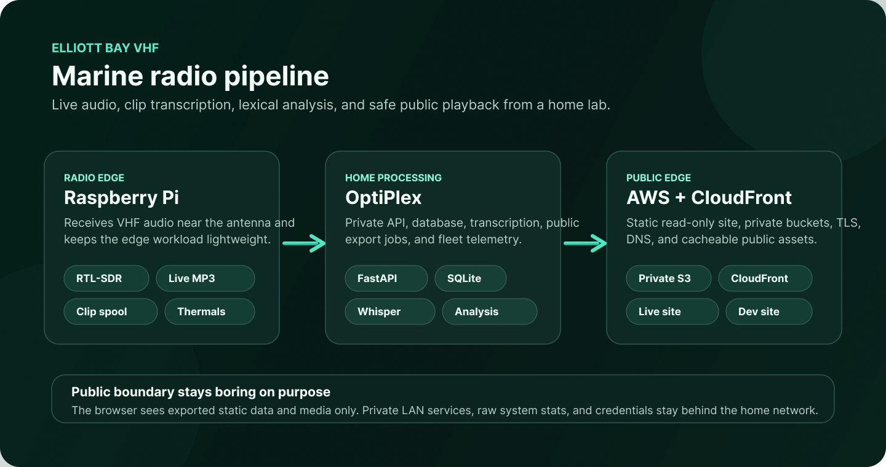

<h1 align="center">Elliott Bay VHF</h1>

<p align="center">
  <strong>
    Live Elliott Bay marine VHF, captured at the radio edge, processed at home, and published safely through AWS.
  </strong>
</p>

<p align="center">
  <a href="https://vhf.robertboscacci.com">Production site</a> &middot;
  <a href="https://vhf-dev.robertboscacci.com">Dev site</a> &middot;
  <a href="docs/security-model.md">Security model</a> &middot;
  <a href="docs/performance.md">Performance telemetry</a> &middot;
  <a href="docs/deployment-hygiene.md">Deployment hygiene</a>
</p>

<p align="center">
  
  
  
  
</p>

<p align="center">
  
</p>

<p align="center">
  <em>
    Diagram source:
    <a href="https://www.figma.com/design/4X91YXb7Q8zBSz8vRaneFV">Figma design</a>.
  </em>
</p>

## What It Is

Elliott Bay VHF is a home-lab marine radio pipeline for live monitoring, recent
clip review, transcription, lexical analysis, and public read-only playback. It
keeps signal-sensitive work next to the antenna, heavier processing on the
OptiPlex, and public delivery on narrow AWS edges.

| Layer | Runs On | Owns |
| --- | --- | --- |
| Radio edge | Raspberry Pi + RTL-SDR | VHF capture, live MP3, activity detection, bounded clip spooling, thermals |
| Home processing | OptiPlex | Private API, SQLite metadata, transcription, exports, live proxy, system telemetry |
| Public edge | AWS S3 + CloudFront | Static app assets, sanitized public audio, TLS, DNS, cacheable read-only delivery |

The public app can read live audio/status and recent clip data, but it does not
expose radio controls, ingest endpoints, the Pi, raw Icecast URLs, database
access, raw S3 keys, or long-lived credentials.

## Architecture

```text
antenna -> RTL-SDR -> Raspberry Pi -> private LAN -> OptiPlex -> private S3 / CloudFront -> browser
```

## First Build Target

- Fun channel: VHF 68, `156.425 MHz`
- Business channel: VHF 14, `156.700 MHz` Seattle Traffic / Puget Sound VTS
- Raw audio: private S3 bucket, `raw/` expires after 60 days
- Prod public site: static S3 origin plus read-only live API behaviors behind
  CloudFront at `vhf.robertboscacci.com`
- Dev public site: separate static S3 origin and CloudFront distribution at
  `vhf-dev.robertboscacci.com`, using the same live origin unless overridden

## Compute And Network Boundaries

The system has three compute tiers:

- **Raspberry Pi, near the antenna:** owns radio capture because it is physically
  close to the SDR and can keep the USB/RF path short. It performs bounded edge
  work: demodulation, speech-band cleanup, audio gating for the browser stream,
  activity detection, rolling WAV segments, and clip sidecar metadata. It should
  keep running even when the internet is down, and it should not need AWS
  credentials.
- **OptiPlex, on the LAN:** owns work that benefits from local CPU, disk, and
  stable services: SQLite, transcription, retry loops, S3 presigning, public
  export generation, the private API, and the read-only CloudFront live origin.
  This is the normal development and operations box for `conda run -n dell ...`
  commands.
- **AWS, public edge:** owns long-lived raw object storage, private static-site
  origins, CloudFront caching, TLS, DNS, and public read-only delivery. AWS is
  deliberately not the primary signal-processing environment.

The normal data path is:

```text
antenna -> RTL-SDR -> Raspberry Pi -> private LAN -> OptiPlex -> private S3 / CloudFront
```

For live monitoring, CloudFront routes browser requests back to the OptiPlex
proxy over the configured Funnel origin, and the OptiPlex reads the Pi's LAN
Icecast streams. Public browsers never connect directly to the Pi or to a LAN
Icecast URL.

## Local Setup

Use the existing `dell` conda environment on the OptiPlex:

```bash
conda run -n dell python -m pip install -e ".[dev]"
conda run -n dell pytest
```

Run the private API locally:

```bash
cp config/examples/private-api.env.example .env
# edit .env, then export it in your shell
conda run -n dell uvicorn talkingboats.api:app --reload --host 0.0.0.0 --port 8034
```

Shared radio UI through the private API:

```text
http://localhost:8034/operator/
```

If you are on a MacBook or another client machine instead of the OptiPlex, you
may have the repo and AWS credentials but not the live SQLite database, Pi systemd
units, or OpenTofu binary. In that case, use SSH to the OptiPlex for export,
transcription, and service work. Direct S3/CloudFront syncs from the MacBook are
acceptable only for emergency static UI fixes where existing manifests and clip
objects are preserved.

The browser UI shows recent transcribed clips and a separate live-monitor tab.
At `vhf.robertboscacci.com` it reads `/api/clips/recent`,
`/api/live/current.mp3`, `/api/live/{channel}/current.mp3`,
`/api/live/{channel}/status`, and `/api/live/channels` from the same origin. If
the live clip API is unavailable, it falls back to `public_manifest.json` and
copied public audio files.

## Fake Radio Simulator

Use the simulator for local exporter tests. It creates small synthetic WAV clips
plus a private manifest shaped like public clip data.

```bash
conda run -n dell talkingboats-simulate-radio \
  --output-dir outputs/simulated-radio \
  --clip-count 8 \
  --seed 20260520 \
  --started-at 2026-05-20T19:12:00Z
```

The generated private manifest intentionally includes private-only fields such as
receiver IDs and raw S3 keys. The public exporter strips those fields before
anything can be published:

```bash
conda run -n dell talkingboats-export-public \
  --private-manifest outputs/simulated-radio/private_manifest.json \
  --site-source public-site \
  --output-dir outputs/public-site \
  --audio-source-dir outputs/simulated-radio/audio
```

## Manual Clip Upload

The Pi-side uploader can be tested with any local audio file before the SDR
pipeline exists. It asks the private API for a presigned S3 upload URL, then PUTs
the clip to that URL. The idempotency key is derived from the channel, timestamp,
and audio bytes so retries of the same clip land on the same raw object key.

```bash
export TALKINGBOATS_PRIVATE_API=http://optiplex.local:8034
export TALKINGBOATS_INGEST_TOKEN=replace-with-private-pi-ingest-token

conda run -n dell talkingboats-upload-clip \
  --channel 68 \
  --audio-path outputs/simulated-radio/audio/some-clip.wav \
  --started-at 2026-05-20T19:12:00Z
```

## Raspberry Pi Reflash

The Pi capture node is prepared from a clean Raspberry Pi OS Lite image. A true
reflash requires the microSD card to be attached to the OptiPlex; it cannot be
safely done over SSH while the Pi is booted from that same card.

Once the card is inserted, identify it with `lsblk`, then run:

```bash
sudo scripts/prepare_pi_sd.sh /dev/sdX
```

Optional Wi-Fi setup avoids storing the password in shell history:

```bash
read -rsp "Wi-Fi password: " WIFI_PASSWORD
printf '%s' "$WIFI_PASSWORD" > /tmp/talkingboats-wifi-pass
sudo scripts/prepare_pi_sd.sh /dev/sdX \
  --wifi-ssid "YourNetworkName" \
  --wifi-password-file /tmp/talkingboats-wifi-pass
rm /tmp/talkingboats-wifi-pass
```

The script writes Raspberry Pi OS Lite 32-bit, enables SSH with
`/home/rob/.ssh/id_ed25519.pub`, creates user `rob`, blacklists the DVB kernel
driver that conflicts with RTL-SDR, copies the project Pi config examples, and
installs first-boot packages for SDR capture.

Default image: Raspberry Pi OS Lite 32-bit, Debian Trixie, 21 Apr 2026. Override
with `RPI_IMAGE_URL` and `RPI_IMAGE_SHA256` if Raspberry Pi publishes a newer
image before we flash.

If an early card was flashed with the duplicate UID bootstrap bug, repair it
offline after inserting the card back into the OptiPlex:

```bash
sudo scripts/repair_pi_user_sd.sh /dev/sdc
```

## Pi Live Radio Smoke

After the RTL-SDR receivers and antenna are plugged into the Pi, verify the
dongles and write down their serials:

```bash
ssh rob@talkingboats-pi.local rtl_test -t
ssh rob@talkingboats-pi.local AIS-catcher -l
```

Install the capture services from a repo checkout on the Pi:

```bash
sudo scripts/install_ais_catcher_pi.sh
sudo deploy/pi/install_live_radio.sh
```

The installer creates a root-only `/etc/talkingboats/live-radio.env`, configures
Icecast with generated local source credentials, and starts:

- `talkingboats-profile-capture.service`: profile-driven voice capture. With
  RTLSDR-Airband installed, the default profile becomes the balanced 12-channel
  voice net centered at `156.675 MHz` and sampled at `2.56 MS/s`; without it,
  the debug profile records VHF 14 for fast transcription feedback.
- `talkingboats-spool-uploader.service`: uploads completed multichannel spool
  files when durable upload env vars are present.
- `talkingboats-ais-catcher.service`: AIS decode on the configured AIS dongle,
  serving the AIS-catcher live web map on the Pi and feeding AIS-catcher's
  community map feed when enabled.

Set the dongle serials in `/etc/talkingboats/live-radio.env` before enabling the
full two-dongle profile:

```bash
TALKINGBOATS_VOICE_SDR_SERIAL=voice-dongle-serial
TALKINGBOATS_VOICE_DEVICE_INDEX=0
TALKINGBOATS_AIS_SDR_SERIAL=ais-dongle-serial
TALKINGBOATS_AIS_DEVICE_INDEX=1
TALKINGBOATS_AIS_WEB_PORT=8100
TALKINGBOATS_AIS_COMMUNITY_FEED=anonymous
```

Serials are preferred. If the RTL-SDRs still both report `00000001`, set
`TALKINGBOATS_VOICE_DEVICE_INDEX` and `TALKINGBOATS_AIS_DEVICE_INDEX` for the
observed device order; the defaults are voice index `0` and AIS index `1`.

For a continuous signal check, override the frequency before the first install,
for example VHF 14:

```bash
sudo env TALKINGBOATS_LIVE_FREQUENCY_HZ=156700000 \
  TALKINGBOATS_LIVE_LABEL="VTS / Seattle Traffic" \
  deploy/pi/install_live_radio.sh
```

## Pi Edge Processing

Keep the cheap, real-time radio work on the Pi. This is a design goal, not a
fallback or bug:

- SDR demodulation with `rtl_fm`.
- Balanced multichannel voice capture with RTLSDR-Airband on the lower marine
  block.
- AIS decode with AIS-catcher on the second dongle around `162 MHz`.
- Live mono MP3 encoding for debug streaming.
- RMS activity detection on raw PCM before encoding.
- Bounded clip spooling under `/opt/talkingboats/spool/clips`.
- Continuous rolling WAV recording under `/opt/talkingboats/spool/continuous`.
- Clip sidecar metadata: channel, UTC timestamps, duration, sample rate, RMS, peak.
- Thermal/load guardrails before optional heavier work.

Keep heavier or stateful work on the OptiPlex:

- Private API, S3 presigning, database, transcription, publishing.
- Backfills and reprocessing of already-spooled clips.

The edge stream service uses one SDR pipeline:

```text
rtl_fm -> ffmpeg cleanup -> talkingboats-edge-capture --tee-stdout -> ffmpeg -> Icecast
```

The systemd unit also sets `Nice=5`, lower I/O priority, and `CPUQuota=85%`.
Tune thresholds in `/etc/talkingboats/live-radio.env`:

```bash
TALKINGBOATS_EDGE_THRESHOLD_RMS=8000
TALKINGBOATS_EDGE_MIN_CLIP_SECONDS=1.0
TALKINGBOATS_EDGE_PRE_ROLL_SECONDS=0
TALKINGBOATS_EDGE_POST_ROLL_SECONDS=0.3
TALKINGBOATS_EDGE_MAX_CLIP_SECONDS=45
TALKINGBOATS_EDGE_RECORD_ENABLED=true
TALKINGBOATS_EDGE_RECORD_SEGMENT_SECONDS=300
TALKINGBOATS_EDGE_RECORD_RETENTION_SECONDS=86400
TALKINGBOATS_EDGE_RECORD_UPLOAD_ENABLED=false
TALKINGBOATS_EDGE_UPLOAD_ENABLED=false
TALKINGBOATS_EDGE_UPLOAD_ENCODE_MP3=true
TALKINGBOATS_EDGE_UPLOAD_AUDIO_FILTER=highpass=f=250,lowpass=f=3200,afftdn=nf=-28,acompressor=threshold=0.06:ratio=3:attack=8:release=180:makeup=4,loudnorm=I=-16:LRA=8:TP=-6
TALKINGBOATS_LIVE_SQUELCH=20
TALKINGBOATS_EDGE_MAX_TEMP_C=72
TALKINGBOATS_EDGE_RESUME_TEMP_C=66
TALKINGBOATS_EDGE_MAX_LOAD_PER_CPU=0.85
TALKINGBOATS_LIVE_AUDIO_SQUELCH_ENABLED=true
TALKINGBOATS_LIVE_SQUELCH_LOOKAHEAD_SECONDS=1.0
```

The debug profile uses VHF 14 with tighter thresholds for fast feedback:

```bash
TALKINGBOATS_CAPTURE_DEBUG_14_SECONDS=180
TALKINGBOATS_CAPTURE_DEBUG_14_THRESHOLD_RMS=5000
TALKINGBOATS_CAPTURE_DEBUG_14_MIN_CLIP_SECONDS=2.0
TALKINGBOATS_CAPTURE_DEBUG_14_POST_ROLL_SECONDS=0.4
TALKINGBOATS_CAPTURE_DEBUG_14_MAX_CLIP_SECONDS=30
TALKINGBOATS_CAPTURE_LIVE_MOUNT=/talkingboats-live.mp3
TALKINGBOATS_CAPTURE_STATUS_PATH=/opt/talkingboats/live-radio/current-status.json
```

The balanced voice-net profile demodulates 12 voice channels in one RTLSDR-Airband
process:

```bash
TALKINGBOATS_CAPTURE_PROFILE=voice_net_balanced
TALKINGBOATS_VOICE_SDR_SERIAL=voice-dongle-serial
TALKINGBOATS_VOICE_SQUELCH_THRESHOLD=-35
TALKINGBOATS_VOICE_SQUELCH_SNR_THRESHOLD=20
```

It writes split-on-transmission files under
`/opt/talkingboats/spool/airband/{05A,06,09,13,14,16,22A,67,68,69,71,72}`.
The browser-facing Icecast mounts stay limited to VHF 13, 14, 16, and 68 while
the spool uploader sends active clips for transcription.

The default local rolling buffer is five-minute WAV segments with 24-hour
retention. Raw audio uploaded to the private S3 `raw/` prefix is governed by the
OpenTofu lifecycle rule and expires after 60 days; the Pi-local buffer is only a
short retry/debug cache so it cannot grow without bound.

Enable durable activity-clip upload only after the private API is reachable from
the Pi and `TALKINGBOATS_INGEST_TOKEN` is configured in
`/etc/talkingboats/live-radio.env`:

```bash
sudo sed -i 's/^TALKINGBOATS_EDGE_UPLOAD_ENABLED=.*/TALKINGBOATS_EDGE_UPLOAD_ENABLED=true/' \
  /etc/talkingboats/live-radio.env
sudo systemctl restart talkingboats-edge-live-radio-stream.service
```

When the private API has `TALKINGBOATS_CLIP_DB_PATH` set, every presigned
activity upload is recorded in SQLite before the Pi PUTs the object to S3. Run
the uploaded clip transcriber on the OptiPlex to retry pending uploads and store
per-clip transcript segments:

```bash
conda run -n dell talkingboats-transcribe-uploaded-clips \
  --db-path /home/rob/.local/share/talkingboats/live-transcripts.sqlite3 \
  --bucket talkingboats-raw-audio \
  --poll-seconds 30
```

The worker writes `uploaded_clips` and `uploaded_clip_segments` rows in the same
SQLite file used by live captions. Missing S3 objects stay in `waiting_upload`
and are retried later, so API presign success and actual object upload can remain
eventually consistent.

The uploaded-clip transcriber keeps VAD off by default so it can hear through
short radio pauses, then drops individual Whisper segments below
`TALKINGBOATS_TRANSCRIBE_MIN_SEGMENT_AVG_LOGPROB=-0.6` so static-only clips do
not get promoted as stock phrases like "Thank you." Set the value much lower,
such as `-10`, when deliberately auditing weak-signal audio.

Speech cleanup is on by default and runs before the edge detector, so uploaded
clips and live debug audio use the same filtered PCM. When Pi activity uploads
encode MP3s, the upload encoder also applies the speech filter plus compression
and loudness normalization before sending clips to the OptiPlex for transcription.
The active rtl_airband spool uploader uses the same upload filter before it
presigns and uploads completed `/opt/talkingboats/spool/airband` clips.
That keeps the private raw upload closer to the audio the public site will play
instead of waiting for export-time processing. Set
`TALKINGBOATS_TRANSCRIBE_TRUST_EDGE_PREPROCESSED_AUDIO=true` on the OptiPlex
uploaded-clip transcriber so edge-encoded MP3 uploads go straight to Whisper
without another local ffmpeg cleanup pass. The live caption transcriber still
uses the same pre-transcription cleanup before Whisper: 16 kHz mono WAV plus the
shared speech filter. The default chain does not include dynamic normalization
because that can raise static before or around the activity gate. Turn cleanup
off only for an A/B test:

```bash
sudo sed -i 's/^TALKINGBOATS_AUDIO_FILTER_ENABLED=.*/TALKINGBOATS_AUDIO_FILTER_ENABLED=false/' \
  /etc/talkingboats/live-radio.env
sudo systemctl restart talkingboats-edge-live-radio-stream.service
```

Default filter chain:

```bash
TALKINGBOATS_AUDIO_FILTER_ENABLED=true
TALKINGBOATS_AUDIO_FILTER=highpass=f=250,lowpass=f=3200,afftdn=nf=-28
TALKINGBOATS_EDGE_UPLOAD_AUDIO_FILTER=highpass=f=250,lowpass=f=3200,afftdn=nf=-28,acompressor=threshold=0.06:ratio=3:attack=8:release=180:makeup=4,loudnorm=I=-16:LRA=8:TP=-6
TALKINGBOATS_TRANSCRIBE_SAMPLE_RATE_HZ=16000
TALKINGBOATS_TRANSCRIBE_TRUST_EDGE_PREPROCESSED_AUDIO=true
```

The live Icecast feed also applies an audio gate by default. Frames below the
same RMS activity threshold used for clip capture are written as silence to the
browser stream while the detector and recorder still see the original PCM. Loud
noise-like static bursts are muted on the browser stream. The live output holds
about one second of lookahead by default so a wall of static can be detected and
silenced before it reaches the browser, and the final MP3 feed has a safety
limiter so monitor audio cannot jump to full scale:

```bash
TALKINGBOATS_LIVE_AUDIO_SQUELCH_ENABLED=true
TALKINGBOATS_LIVE_SQUELCH_LOOKAHEAD_SECONDS=1.0
TALKINGBOATS_LIVE_OUTPUT_FILTER=alimiter=limit=0.55
```

## Live Transcription

Install the optional open-source transcriber dependencies on the OptiPlex:

```bash
conda run -n dell python -m pip install -e ".[transcribe]"
conda install -n dell -y -c conda-forge ffmpeg
```

Run captions from the OptiPlex against the Pi Icecast stream:

```bash
conda run -n dell talkingboats-live-transcriber \
  --stream-url http://talkingboats-pi.local:8000/talkingboats-live.mp3 \
  --host 0.0.0.0 \
  --port 8055 \
  --model-size turbo \
  --beam-size 5 \
  --device cpu \
  --compute-type int8
```

The transcriber uses `faster-whisper` with Whisper `turbo` by default because it
is a practical open-source CPU path for this hardware. It uses local beam search
with `TALKINGBOATS_TRANSCRIBE_BEAM_SIZE=5` by default for better accuracy without
paying for an API. For slower offline experiments, set
`TALKINGBOATS_TRANSCRIBE_MODEL=large-v3` or `distil-large-v3`; for local jargon,
set `TALKINGBOATS_TRANSCRIBE_HOTWORDS` to phrases such as
`Seattle Traffic, Elliott Bay, VTS`. If an `ffmpeg` binary is available it
downsamples live audio to 16 kHz mono and applies the same speech cleanup filter
before transcription; otherwise live captions fall back to pulling short MP3
chunks from Icecast and decoding them through PyAV/faster-whisper. It serves:

```text
http://optiplex.local:8055/api/live-transcript
```

For the public read-only browser origin, run the OptiPlex proxy locally and
point Tailscale Funnel at it:

```bash
sudo install -m 0644 deploy/systemd/talkingboats-live-radio-proxy.service.example \
  /etc/systemd/system/talkingboats-live-radio-proxy.service
sudo systemctl daemon-reload
sudo systemctl enable --now talkingboats-live-radio-proxy.service
tailscale funnel --bg --https=10000 http://127.0.0.1:8095
```

The proxy serves the same `public-site/` UI for direct origin checks, forwards
only read-only public API calls to the private API, and exposes a read-only
current receiver stream plus per-channel streams for the continuously monitored
VHF channels. CloudFront routes the public app to:

```text
https://vhf.robertboscacci.com/api/clips/recent
https://vhf.robertboscacci.com/api/analysis/lexical
https://vhf-dev.robertboscacci.com/ais-catcher/
https://vhf.robertboscacci.com/api/live/current.mp3
https://vhf.robertboscacci.com/api/live/13/current.mp3
https://vhf.robertboscacci.com/api/live/14/current.mp3
https://vhf.robertboscacci.com/api/live/68/current.mp3
```

The CloudFront live origin is configurable with `live_origin_domain_name` and
`live_origin_https_port`; by default it points at
`optiplex.tailbea63b.ts.net:10000`.

`/api/live/current.mp3` keeps the stable default VHF 14 behavior. The channel
paths proxy only their configured Icecast mounts, and `/api/live/channels`
returns browser-safe labels and same-origin paths without exposing LAN hostnames
or upstream stream URLs. RTLSDR-Airband writes those live Icecast outputs
continuously so the browser receives silence while the squelch is closed instead
of waiting for a new burst before playback can start. Caption and retune
endpoints remain off by default. Do not set
`TALKINGBOATS_PROXY_ENABLE_DEBUG_ENDPOINTS=true` on the Funnel-backed public
origin.

Dev previews can request the experimental warm voice chain with
`?dsp=warm_voice`; the checked-in browser UI only adds that query on
`vhf-dev.robertboscacci.com`. The proxy keeps prod raw unless the client
explicitly asks for a DSP profile. Set `TALKINGBOATS_PROXY_FFMPEG_PATH` if the
service should use a non-default `ffmpeg` binary.

Use the local analysis helper to compare clips before and after a filter change:

```bash
conda run -n dell talkingboats-analyze-audio clip.mp3 filtered-clip.mp3
```

`/api/live/status` and `/api/live/{channel}/status` expose only channel
label/frequency and an expected 1-5 second stream-delay budget for the browser
UI. They do not expose LAN hostnames, upstream stream URLs, tokens, or raw
receiver configuration. The live waveform is rendered client-side from the
audio element via Web Audio; when the squelched stream is quiet it switches to a
waiting state until the next transmission comes through.

The simple `talkingboats-live-radio-stream.service` remains installed as an
escape hatch, but the installer disables it so only one process owns the SDR.

## Live AIS

AIS uses the second RTL-SDR so it does not compete with the voice-net dongle.
AIS-catcher is started with the configured serial/device index, exposes its
built-in live web map on the Pi, and can feed the AIS-catcher community map:

```bash
TALKINGBOATS_AIS_SDR_SERIAL=ais-dongle-serial
TALKINGBOATS_AIS_DEVICE_INDEX=1
TALKINGBOATS_AIS_WEB_PORT=8100
TALKINGBOATS_AIS_COMMUNITY_FEED=anonymous
TALKINGBOATS_AIS_SHARING_KEY=
```

Set `TALKINGBOATS_AIS_COMMUNITY_FEED=off` to keep AIS-catcher local-only, or set
`TALKINGBOATS_AIS_COMMUNITY_FEED=key` with `TALKINGBOATS_AIS_SHARING_KEY` if the
station should use a registered AIS-catcher sharing key.

```text
/ais-catcher/
```

The live proxy exposes that viewer only on dev/local hosts and strips viewer
cookies, authorization headers, and upstream `Set-Cookie` headers. The prod site
hides the AIS tab; tighter clip-to-vessel integration can build on this later.

## Public Export

The primary exporter turns the recent transcribed clip DB into a static site with
copied public audio files. The browser UI shows timestamps in Pacific time and
the clip review list can filter by channel; the live API fetches filtered channel
views directly so sparse channels are not hidden behind busier channels. The dev
site also exposes a Language tab that reads cached lexical-analysis JSON and a
static topic-cluster plot from `analysis/`.

Generate the lexical artifacts before export. The exporter preserves the
existing `analysis/` directory when it refreshes the static site files:

```bash
conda run -n dell talkingboats-analyze-transcripts \
  --db-path /home/rob/.local/share/talkingboats/live-transcripts.sqlite3 \
  --output-dir outputs/public-site
```

Install the optional analysis extra only on machines that should run BERTopic:

```bash
conda run -n dell python -m pip install -e ".[analysis]"
```

```bash
conda run -n dell talkingboats-export-public \
  --clip-db-path /home/rob/.local/share/talkingboats/live-transcripts.sqlite3 \
  --raw-bucket "$(cd infra/opentofu && tofu output -raw raw_audio_bucket)" \
  --site-source public-site \
  --output-dir outputs/public-site
```

Public clip audio is processed during export. The exporter applies speech-band
compression and loudness normalization with a true-peak ceiling of `-6 dB`, so
browser playback is closer to normal device volume while the private raw S3
objects remain untouched. Recent-clip exports also probe the raw source and skip
public entries shorter than one second or with an almost silent source peak; this
keeps subsecond transcriber hallucinations out of the dashboard. Use
`--no-public-audio-processing` only for emergency debug copies, or
`--public-audio-ffmpeg-path` / `--public-audio-ffprobe-path` if the service
should use non-default media binaries.

The older private-manifest mode remains for local simulator tests only.

Deploy dev first, then prod after the public checks look right:

```bash
scripts/deploy_public_site.sh dev outputs/public-site
scripts/deploy_public_site.sh prod outputs/public-site
```

To keep the Language tab fresh, install the scheduled lexical refresh on the
OptiPlex. It rebuilds the lexical JSON, suspected entities, and BERTopic/UMAP
topic plot from the current transcript DB, rebuilds the public export, and
deploys the dev site every six hours. The script uses a lock directory so a slow
topic run skips the next tick instead of overlapping itself.

```bash
sudo install -m 0644 deploy/systemd/talkingboats-lexical-refresh.service.example \
  /etc/systemd/system/talkingboats-lexical-refresh.service
sudo install -m 0644 deploy/systemd/talkingboats-lexical-refresh.timer.example \
  /etc/systemd/system/talkingboats-lexical-refresh.timer
sudo systemctl daemon-reload
sudo systemctl enable --now talkingboats-lexical-refresh.timer
```

If installing as the `rob` user instead of a system service:

```bash
mkdir -p ~/.config/systemd/user
cp deploy/systemd/talkingboats-lexical-refresh.service.example \
  ~/.config/systemd/user/talkingboats-lexical-refresh.service
cp deploy/systemd/talkingboats-lexical-refresh.timer.example \
  ~/.config/systemd/user/talkingboats-lexical-refresh.timer
systemctl --user daemon-reload
systemctl --user enable --now talkingboats-lexical-refresh.timer
```

Run one refresh manually:

```bash
scripts/refresh_lexical_analysis.sh
```

The refresh defaults to:

- DB: `/home/rob/.local/share/talkingboats/live-transcripts.sqlite3`
- output: `outputs/public-site`
- deploy target: `dev`
- conda env: `dell`

Use `.env` or systemd environment overrides such as
`TALKINGBOATS_LEXICAL_DEPLOY_ENV`, `TALKINGBOATS_LEXICAL_DB_PATH`, and
`TALKINGBOATS_LEXICAL_OUTPUT_DIR` if a host needs different paths. Do not set
`TALKINGBOATS_LEXICAL_DEPLOY_ENV=prod` unless you intend to promote the refreshed
analysis to prod; the prod deploy helper still enforces a clean `main` worktree.

Keep branch and resource separation explicit:

- Dev deploys go to the separate dev S3 origin and CloudFront distribution behind
  `vhf-dev.robertboscacci.com`.
- Prod deploys go to the prod S3 origin and CloudFront distribution behind
  `vhf.robertboscacci.com`.
- The deploy helper allows prod only from a clean `main` worktree. Use `dev`,
  `codex/*`, or `feature/*` for dev validation, then merge through `main` for
  prod.

See [Deployment Hygiene](docs/deployment-hygiene.md) for the branch policy,
resource matrix, and emergency override rules.

Public URLs:

- Dev: `https://vhf-dev.robertboscacci.com`
- Prod: `https://vhf.robertboscacci.com`

## AWS Infrastructure

Infrastructure lives in `infra/opentofu`.

```bash
cd infra/opentofu
tofu init
tofu plan
```

Do not run `tofu apply` until the bucket names, AWS profile, and Route 53 hosted
zone are confirmed. The stack creates paid AWS resources: separate dev/prod S3
buckets, CloudFront distributions, ACM certificate validation records, Route 53
alias records, and IAM policies for private server publishing.

## Security Rules

- Raw audio buckets are private and have public access blocked.
- Public buckets are private and readable only by their matching CloudFront OAC.
- The Pi does not get long-lived AWS credentials; it asks the private API for a
  short-lived presigned upload URL.
- Live radio is public read-only through CloudFront and Tailscale Funnel; control
  and write endpoints stay private, and public hosting never exposes a LAN
  Icecast URL.
- Public exports reject private URLs, raw S3 keys, receiver IDs, AWS account IDs,
  and unreviewed transcripts.
