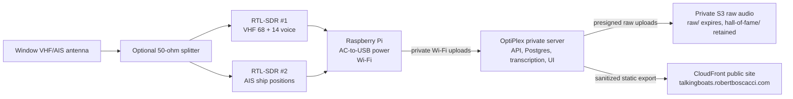

# Hardware Guide

## Apartment Layout

Keep the radio gear near the window and move data over Wi-Fi.

## First Parts List

- Two RTL-SDR-class receivers with TCXO and SMA connectors.
- One window-friendly VHF antenna to start. Add a second antenna only if splitting
  one antenna hurts voice or AIS reception.
- Optional 50-ohm splitter for sharing the antenna between SDRs.
- Quality Pi power supply. For Pi 3-class hardware, use a 5.1V / 2.5A micro-USB
  supply.
- Optional powered USB hub if the Pi reports undervoltage with two SDRs attached.

## Shopping Checklist

### RTL-SDR Receivers

Buy **two** receivers that match all of these:

- `RTL2832U` chipset.
- Tuner is one of: `R820T2`, `R860`, or `R828D`.
- Frequency coverage includes both `156 MHz` marine VHF and `162 MHz` AIS.
- Has a `TCXO` clock, ideally `0.5 ppm` or `1 ppm`.
- Antenna connector is real `SMA female`, not MCX.
- Metal case preferred.
- Works on Linux/Raspberry Pi with `rtl-sdr` tools.

Avoid:

- Generic white `DVB-T` TV sticks unless they explicitly say `TCXO` and list the
  tuner chip.
- Anything with only an `MCX` antenna connector.
- Expensive `Ham It Up` or HF upconverter bundles. They are for shortwave/HF and
  are not needed for 156-162 MHz marine monitoring.
- Used RTL-SDR Blog dongles priced above new official units unless they include
  accessories you actually need.

### Antenna

Apartment starter antenna:

- Telescoping scanner/VHF antenna, ideally adjustable to roughly `18 inches`.
- Connector can be `BNC`, `SMA`, or `SO-239`, but plan adapters to the SDR's
  `SMA female` input.
- Put it vertically in or near the window.

Better marine antenna if placement is easy:

- Marine VHF antenna for `156-162 MHz`, `50 ohm`.
- 3-foot whip is enough for an apartment/window experiment.
- Common connector is `PL-259`/`SO-239`, so budget for an adapter or short jumper
  to SMA.

### Splitter Or Two Antennas

Start without a splitter if you can place two small antennas near the window.

If using one antenna for both SDRs, buy:

- Passive `2-way` RF splitter/combiner.
- `50 ohm`, not TV/cable `75 ohm`.
- Frequency range must include at least `156-162 MHz`; examples like `5-500 MHz`,
  `10-500 MHz`, or `1-750 MHz` are fine.
- Expect about `3.5 dB` signal loss from splitting.

### Power And USB

- Pi 3-class board: use a `5.1V 2.5A` micro-USB power supply.
- Pi 4-class board: use the official USB-C supply or equivalent.
- If the Pi shows undervoltage or SDRs vanish, add a powered USB hub with its own
  AC adapter.
- USB 2.0 is fine for this project; the SDR bandwidth is small.

### Connector Cheat Sheet

- SDR input: usually `SMA female`.
- Most small scanner antennas: often `BNC male`.
- Many marine antennas: `PL-259` plug or `SO-239` socket.
- Useful adapters/jumpers:
  - `BNC female to SMA male` for BNC scanner antennas into RTL-SDR dongles.
  - `SO-239/UHF female to SMA male` or a short RG316 jumper for marine antennas.
  - Short cables are better than rigid adapter stacks when the Pi is near a
    window and might get bumped.

## Channel Plan

- VHF 68, `156.425 MHz`: Fun Channel for pleasure-craft working traffic.
- VHF 14, `156.700 MHz`: Super Business Channel for Seattle Traffic / Puget Sound
  VTS.
- AIS 1/2, `161.975 MHz` and `162.025 MHz`: vessel identity and position packets.

## Blog/Figma Diagram Notes

The Mermaid diagram above is the source of truth for a polished Figma/FigJam
diagram. Keep the public/private boundary visible: public viewers can see only the
static site and reviewed clips, never the Pi, live stream, private API, database,
or raw S3 archive.
