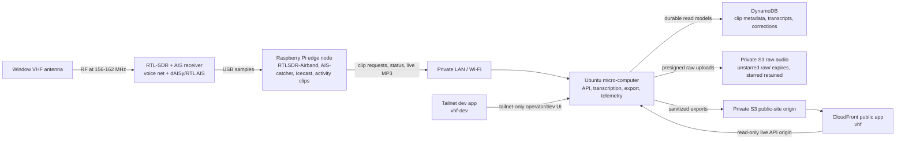

# Hardware Guide

## Apartment Layout

Keep the RF path short and move data over the LAN. The antenna and RTL-SDR sit
near the best window; the Raspberry Pi is the small edge computer beside them.
The Ubuntu micro-computer stays where it belongs as the home processing node
with more CPU, disk, and stable services.



This layout is intentional. The Pi is not a weak substitute for the Ubuntu
micro-computer; it is the right place for low-latency radio plumbing because it
is physically close to the antenna and SDR. The Ubuntu micro-computer is the
right place for local CPU-heavy work and service supervision: transcription,
retry loops, publishing, realtime telemetry, and the public proxy. AWS is the
durable/public edge for clip metadata, transcripts, raw audio, static assets,
and public read-only delivery.

## Signal And Data Path

The normal path is:

```text
antenna -> RTL-SDR -> Raspberry Pi -> private LAN -> Ubuntu micro-computer -> AWS public edge
```

- **RF and USB/serial:** the antennas feed the voice RTL-SDR and either the
  dAISy-catcher serial AIS receiver or the fallback AIS RTL-SDR. Keep this
  physically simple: short antenna jumpers, stable power, and enough
  ventilation.
- **Pi edge work:** the Pi runs RTLSDR-Airband for the lower-block voice net,
  AIS-catcher for live AIS, speech-band cleanup, squelch/gating, Icecast MP3
  output, rolling WAV buffers, and activity clip detection. It can keep short
  retry/debug buffers locally under `/opt/talkingboats/spool`.
- **LAN handoff:** the Pi reaches the Ubuntu micro-computer over private Wi-Fi/LAN.
  The current Pi is reached from the Ubuntu micro-computer at `192.168.1.114`;
  mDNS names can be stale, so verify the live address before changing receiver
  or telemetry settings. The Pi asks the private API for presigned upload URLs
  instead of holding cloud credentials.
- **Ubuntu micro-computer processing:** the Ubuntu micro-computer records clip metadata through the
  DynamoDB-backed store, retries pending uploads, transcribes clips, generates
  static exports, and exposes the read-only proxy that CloudFront can call.
- **Cloud public edge:** DynamoDB stores durable clip metadata, transcripts, and
  corrections. S3 stores raw private audio and sanitized public-site files.
  Unstarred raw audio expires after 90 days; starred clips are retained.
  CloudFront and Route53 provide the public `vhf` domain with only read-only
  app, clip, status, and live-audio paths. Route53 points `vhf-dev` to the
  Ubuntu micro-computer tailnet address for private dev/operator access.

If a laptop is used for repo edits, remember that it is usually a control plane,
not the runtime host. The Ubuntu micro-computer is where the long-running
workers, service environment, and local realtime telemetry normally live.

## First Parts List

- One RTL-SDR-class receiver with TCXO and SMA connector.
- One window-friendly VHF antenna to start.
- One Raspberry Pi close to the window to own the SDR and local Icecast stream.
- One Ubuntu micro-computer or similar always-on LAN server for transcription and publishing.
- Quality Pi power supply. For Pi 3-class hardware, use a 5.1V / 2.5A micro-USB
  supply.
- Optional powered USB hub if the Pi reports undervoltage with two SDRs attached.

## Shopping Checklist

### RTL-SDR Receivers

Buy **two** receivers that match all of these:

- `RTL2832U` chipset.
- Tuner is one of: `R820T2`, `R860`, or `R828D`.
- Frequency coverage includes `156 MHz` marine VHF.
- Has a `TCXO` clock, ideally `0.5 ppm` or `1 ppm`.
- Antenna connector is real `SMA female`, not MCX.
- Metal case preferred.
- Works on Linux/Raspberry Pi with `rtl-sdr` tools.

Avoid:

- Generic white `DVB-T` TV sticks unless they explicitly say `TCXO` and list the
  tuner chip.
- Anything with only an `MCX` antenna connector.
- Expensive `Ham It Up` or HF upconverter bundles. They are for shortwave/HF and
  are not needed for 156-162 MHz marine monitoring.
- Used RTL-SDR Blog dongles priced above new official units unless they include
  accessories you actually need.

### Antenna

Apartment starter antenna:

- Telescoping scanner/VHF antenna, ideally adjustable to roughly `18 inches`.
- Connector can be `BNC`, `SMA`, or `SO-239`, but plan adapters to the SDR's
  `SMA female` input.
- Put it vertically in or near the window.

Better marine antenna if placement is easy:

- Marine VHF antenna for `156-162 MHz`, `50 ohm`.
- 3-foot whip is enough for an apartment/window experiment.
- Common connector is `PL-259`/`SO-239`, so budget for an adapter or short jumper
  to SMA.

### Power And USB

- Pi 3-class board: use a `5.1V 2.5A` micro-USB power supply.
- Pi 4-class board: use the official USB-C supply or equivalent.
- If the Pi shows undervoltage or SDRs vanish, add a powered USB hub with its own
  AC adapter.
- USB 2.0 is fine for this project; the SDR bandwidth is small.

### Connector Cheat Sheet

- SDR input: usually `SMA female`.
- Most small scanner antennas: often `BNC male`.
- Many marine antennas: `PL-259` plug or `SO-239` socket.
- Useful adapters/jumpers:
  - `BNC female to SMA male` for BNC scanner antennas into RTL-SDR dongles.
  - `SO-239/UHF female to SMA male` or a short RG316 jumper for marine antennas.
  - Short cables are better than rigid adapter stacks when the Pi is near a
    window and might get bumped.

## Channel Plan

- Voice dongle: center at `156.675 MHz`, sample at `2.56 MS/s`, and demodulate
  the balanced 12-channel profile: `05A`, `06`, `09`, `13`, `14`, `16`, `22A`,
  `67`, `68`, `69`, `71`, and `72`.
- AIS receiver: AIS-catcher handles AIS 1 / AIS 2 near `162 MHz`, serves its
  live map on the Pi, and optionally feeds AIS-catcher's community map. Prefer
  the dAISy-catcher serial receiver with `TALKINGBOATS_AIS_INPUT=auto` or
  `serial`; the wrapper falls back to the AIS RTL-SDR when no serial receiver is
  present. Use `TALKINGBOATS_AIS_SERIAL_PORT=/dev/serial0` only after the Pi
  serial console is disabled and GPIO serial is enabled for HAT mode. Because
  antenna jumpers can be ambiguous, verify the active antenna by comparing live
  AIS message rate and nearby-vessel freshness after each cable move rather than
  trusting labels. The dev web app embeds the AIS-catcher viewer through the live
  proxy. The Pi wrapper sets the web viewer station identity to
  `Elliott Bay VHF`, links it to `https://robertboscacci.com`, and shares an
  approximate Elliott Bay location with the local viewer by default.
- VHF 68, `156.425 MHz`: Fun Channel for pleasure-craft working traffic.
- VHF 14, `156.700 MHz`: Super Business Channel for Seattle Traffic / Puget Sound
  VTS.

## Local Compute Roles

Use the hardware for what it is good at:

- **Raspberry Pi:** edge capture, stream continuity, activity gating, short
  rolling buffers, and safe retry queues. Keep memory and CPU bounded.
- **Ubuntu micro-computer:** Whisper/faster-whisper, S3 interaction, publishing, lexical
  analysis, realtime telemetry, and public proxying. This is where the `dell`
  conda environment and long-running services normally live.
- **MacBook or other laptop:** development, emergency AWS/static-site operations,
  and browser checks. Do not assume it has the Ubuntu micro-computer runtime state.
- **AWS:** DynamoDB clip/transcript/correction durability, private object
  storage, CloudFront, DNS, TLS, and public read-only delivery.

## Blog/Figma Diagram Notes

The Mermaid diagram above is the source of truth for a polished Figma/FigJam
diagram. Keep the public/private boundary visible: public viewers can see only
the read-only live app, exported clips, and current receiver audio, never radio
controls, write APIs, private database access, or the raw S3 archive.
